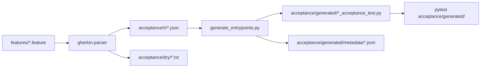

# Plan A: Sane Committed Acceptance Snapshot

Make the committed snapshot portable and internally consistent, while leaving IR and generated tests tracked. That keeps `pytest acceptance/generated/` working and sets up Plan B (`features/` as the only committed input; IR/generated later become `build/` output).

## Decisions

- **One source root:** `features/`. Not a second live root, and not a later move.
- **Membership:** `features/` is the allowlist. Only Gherkin that already has (or is the remapped source of) a committed IR/test/metadata record moves there in this change.
- **Leftovers stay out:** ~48 `.feature` files with no snapshot (report/run/QA/runtime-split/f787 drafts, plus `tests/stpa/features/stpa_run_*` and `stpa_report_*`) stay where they are until someone opts them in by moving them into `features/` and regenerating. Plan B will generate everything under `features/`, so putting unwired files there now would break the suite.
- **Mutation stamps stay in feature files**, but every `feature_path` becomes repo-relative.

## Current breakage

```text
features (today)     127 files in two roots
IR JSON              90  (3 are dry reports named *.json)
generated tests      87
metadata             91  (4 orphans, no matching test)
absolute paths       241 files under acceptance/ + feature stamps
tracked-but-ignored  .swarmforge/reports/mutation-score.txt
                     ai/findings/acceptance-staleness-analysis-er9q-in8d.md
```

`acceptance/generate_entrypoints.py` embeds `ir_file.resolve()` into both the test and metadata, and invents `feature_path` by turning the IR stem into spaces (`"sp1 revision"`). Mutation manifests store `/Users/...` paths.

Name remaps that must disappear:

| Current source | Current IR/test stem |
|---|---|
| `tests/stpa/features/sp1_graceful_degradation_recoverable.feature` | `gd_recoverable_ir` |
| `tests/stpa/features/sp1_graceful_degradation_stage_error.feature` | `gd_stage_error_ir` |
| `acceptance/features/072o/sp3-*.feature` | `sp3_072o_*` |

`acceptance/ir/sp1_merge_fallback_sanitize_baseline.json` is a second IR for the same feature name as `sp1_merge_fallback_sanitize`. Treat it as an orphan unless a content diff shows unique scenarios; if unique, split it into its own feature under `features/` instead of keeping a hidden alias.

## Target contract

```text
features/<rel>.feature
  → acceptance/ir/<rel>.json
  → acceptance/generated/<stem>_acceptance_test.py
  → acceptance/generated/metadata/<slug>.json

acceptance/dry/<rel>.txt     gitignored DRY reports only
```

`<rel>` preserves subdirs (`features/critic-revision-fix/critic-gap-detection.feature` → `acceptance/ir/critic-revision-fix/critic-gap-detection.json`). Generated tests stay flat; validation fails on duplicate stems.

Metadata shape:

```json
{
  "schema_version": 1,
  "feature_path": "features/sp1_revision.feature",
  "ir_path": "acceptance/ir/sp1_revision.json",
  "feature_hash": "sha256:...",
  "implementation_hash": "sha256:...",
  "hash_scope": "generated_files",
  "generated_files": ["sp1_revision_acceptance_test.py"]
}
```

Generated tests resolve IR at runtime from the repo root (existing `pyproject.toml` walk), never via an embedded absolute path:

```python
ir_path = _PROJECT_ROOT / "acceptance/ir/sp1_revision.json"
```

No `/Users/`, `/private/`, or `file://` in features, IR, generated tests, or metadata.



## Implementation

### 1. Document and encode the mapping

Add `acceptance/SNAPSHOT.md` (short): roots, mapping, membership rule, Plan B handoff note. Point at it from `CLAUDE.md`.

Add `acceptance/snapshot.py` as the single mapping module: discover `features/**/*.feature`, compute IR/test/metadata paths, slugify, reject stem collisions. Generator, refresh, and validation all import this. Do not hard-code `tests/stpa/features` or `acceptance/features` anywhere new.

### 2. Move snapshot features into `features/`

`git mv` every feature that is in the current snapshot (or is the remapped source of one) into `features/`, keeping existing subdir grouping where it already exists (`critic-revision-fix/`, `stage2-restructure/`, `072o/`, …). Flatten STPA files that already live flat under `tests/stpa/features/` to `features/<name>.feature`.

Update path literals in unit tests, QA notes, and scripts that mention `tests/stpa/features/` or `acceptance/features/` for those moved files.

Leave leftover Gherkin in the old trees. After the move, old dirs will still hold non-snapshot files; do not delete those files.

### 3. Make generation portable

Change `acceptance/generate_entrypoints.py` to:

- take the repo-relative feature path (or read it from the mapping module);
- write repo-relative `ir_path` / `feature_path`;
- write `feature_hash` of the source `.feature`;
- emit tests that join `_PROJECT_ROOT` with the relative IR path.

Add `acceptance/refresh_snapshot.py` (Plan B seed, still writing into the committed dirs):

1. discover `features/**/*.feature`
2. `gherkin-parser` → `acceptance/ir/<rel>.json`
3. `gherkin-ir-dry-checker` → `acceptance/dry/<rel>.txt` only
4. generate entrypoints + metadata
5. delete IR/tests/metadata whose source feature no longer exists

Keep `SWARMFORGE_ACCEPTANCE_CMD="uv run pytest acceptance/generated/ -q"`. Plan B switches that to generate-then-run.

### 4. Rewrite mutation manifests in place

One-shot rewrite of every `# acceptance-mutation-manifest-begin` block: `feature_path` becomes the repo-relative path. Keep stamps, hashes, and results. If a later mutation run reintroduces an absolute path, the snapshot validator fails.

### 5. Clean the committed snapshot

- Delete `acceptance/ir/*_dry.json`, `acceptance/ir/*_dry.txt`, and any other dry reports under `acceptance/ir/`.
- Delete the four orphan metadata files named in the findings doc.
- Drop `sp1_merge_fallback_sanitize_baseline` (or split it; see above).
- `git rm --cached` `.swarmforge/reports/mutation-score.txt` and `ai/findings/acceptance-staleness-analysis-er9q-in8d.md`. Directories stay ignored.
- Run `refresh_snapshot.py` so every `features/` file has exactly one IR, one generated test, and one metadata file, with remapped stems gone.

### 6. Snapshot validation

Extend `tests/stpa/test_acceptance_harness_property.py` (it already walks IR ↔ entry points and currently expects absolute `Path(r"...")` strings) and add a focused snapshot test that fails when:

- generated files, metadata, IR, or feature manifests contain absolute local paths;
- metadata points at a missing feature/IR/test;
- a `features/**/*.feature` lacks IR, test, or metadata;
- an IR/test/metadata has no source feature;
- `feature_hash` does not match the current feature file (staleness);
- `git ls-files -ci --exclude-standard` is non-empty.

Update `_entry_point_ir_refs()` for the new relative-path form.

## Out of scope (Plan B)

- Untracking `acceptance/ir/` or `acceptance/generated/`
- Moving outputs to `build/acceptance/`
- Changing `SWARMFORGE_ACCEPTANCE_CMD` to a generate-first command
- Generating leftovers that are not in `features/`
- Stripping mutation manifests from feature files

## Validation

- `uv run pytest tests/stpa/test_acceptance_harness_property.py` plus the new snapshot tests
- `uv run pytest acceptance/generated/` still collects and runs (same known-red baseline as `CLAUDE.md`: LLM-blocked + out-of-scope reds, not new path failures)
- `rg -n '/Users/|/private/|file://' features acceptance/ir acceptance/generated` is empty
- `git ls-files -ci --exclude-standard` is empty
- A checkout at another path produces the same generated files (relative paths + hashes)

## Suggested beads after approval

- `snapshot-contract`: mapping module + SNAPSHOT.md
- `snapshot-move-features`: git mv + reference updates
- `snapshot-portable-generate`: generator + refresh script
- `snapshot-clean-and-validate`: orphans, untrack ignored files, rewrite stamps, regenerate, tests

Conservative Beads profile: implement after this spec is approved; do not commit or `bd` unless asked. Role droids do not run `bd`.