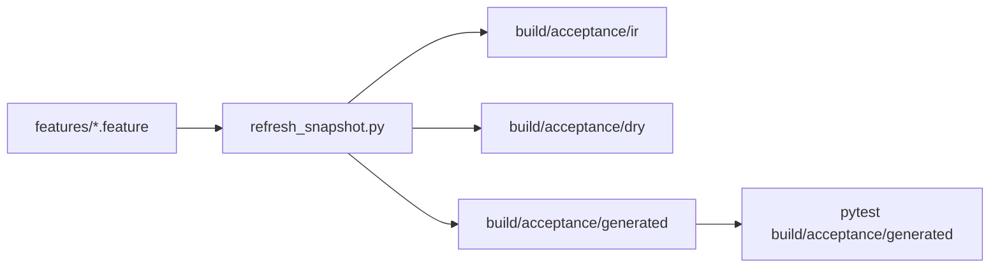

# Plan B: Generated Acceptance Output

Move IR, dry reports, generated tests, and metadata out of Git. `features/` plus acceptance-pipeline source remain the only committed acceptance inputs. A fresh checkout must reconstruct the suite without committed generated files.

## Decisions

- **Data tables:** rewrite remaining step tables to APS-native Gherkin. Multi-row fixture tables cannot become Example rows without changing scenario cardinality, so they become **named fixture steps**. One-row profile tables become **Scenario Outline Examples**.
- **Verification:** local `scripts/verify_acceptance_fresh.sh` plus unit tests. No GitHub Actions.
- **Layout:** Plan B paths from the findings doc, consumed from `snapshot.py` / env vars, not hardcoded in new tooling.

```text
features/                         committed source
acceptance/                       runtime, generator, handlers
build/acceptance/ir/              ignored IR
build/acceptance/dry/             ignored DRY reports
build/acceptance/generated/       ignored tests + metadata
build/acceptance-mutation/        ignored mutation workspace
```



## 1. Make the six table features APS-parseable

Only three files still have step data tables. The three `*_run_orchestration` files already use Examples.

`features/calls_html_rendering.feature`
- Background 4-row calls.jsonl table → `Given the standard four-call calls.jsonl fixture`
- CH-08 2-row table → `Given a two-successful-call calls.jsonl fixture`

`features/sp1_calls_html_full_content.feature`
- FullContent-12 2-row table → the same two-successful-call fixture step

`features/model_profiles.feature`
- Background 3-profile table → `Given the standard three-profile YAML fixture`
- MP-02 / MP-03 / MP-08 one-row tables → Scenario Outline Examples whose columns are the profile fields

Update the handlers in `acceptance/runtime_features/sp1_revision.py` (and any profiles helper they call) so named fixtures and Example-driven profile steps build the same world state the data tables used to. Then delete `_restore_data_tables` from `acceptance/refresh_snapshot.py`.

Add a snapshot/lint check that fails if any `features/**/*.feature` still has a step data table (a `|` row outside an `Examples:` block).

Prove this slice **before** untracking IR: `uv run pytest acceptance/generated/` stays at the known 9 failed / 77 passed baseline.

## 2. Centralize paths and generate into `build/`

Make `acceptance/snapshot.py` the only path owner. Defaults:

```sh
SWARMFORGE_ACCEPTANCE_FEATURES_DIR=features
SWARMFORGE_ACCEPTANCE_IR_DIR=build/acceptance/ir
SWARMFORGE_ACCEPTANCE_DRY_DIR=build/acceptance/dry
SWARMFORGE_ACCEPTANCE_GENERATED_DIR=build/acceptance/generated
SWARMFORGE_ACCEPTANCE_MUTATION_DIR=build/acceptance-mutation
```

Read those from the environment in `snapshot.py`. Point `refresh_snapshot.py`, `generate_entrypoints.py`, harness tests, and the runner adapter at those constants.

Fix generated-test bootstrap: today tests assume `_GENERATED_DIR.parent` is `acceptance/`. After the move that parent is `build/acceptance/`. Generated tests must find the repo root via `pyproject.toml` and import runtime from `_PROJECT_ROOT / "acceptance"`.

Evolve `acceptance/refresh_snapshot.py` into the one generate command:

```text
discover features/
parse with gherkin-parser
run gherkin-ir-dry-checker
generate tests + metadata
delete stale build artifacts
optionally run pytest on the generated tests
```

`--run` (or equivalent) executes pytest after generation. The command must succeed from an empty `build/` and must not read `acceptance/ir/` or `acceptance/generated/`.

`.factory/swarmforge/config.sh`:

```sh
SWARMFORGE_ACCEPTANCE_CMD="uv run python acceptance/refresh_snapshot.py --run"
```

`pyproject.toml` stays unit-test-only (`testpaths = ["tests"]`). `build` is already in `norecursedirs`; add `build/` to `.gitignore`.

## 3. Untrack generated artifacts

Only after generate-from-empty-`build/` reproduces the suite:

- `git rm -r --cached acceptance/ir acceptance/generated`
- leave the files on disk until the first generate, or delete them and regenerate into `build/`
- do not commit anything under `build/`

Update `acceptance/SNAPSHOT.md` and `CLAUDE.md`: committed inputs are `features/` + acceptance source; regenerate with the refresh command; run pytest on `build/acceptance/generated/`.

Change `validate_snapshot` for the new contract:

- committed tree must not contain IR/tests/metadata
- after generate, every `features/` file has exactly one IR, test, and metadata record under `build/`
- no absolute local paths
- `git ls-files -ci --exclude-standard` is empty
- no step data tables remain in `features/`

`test_committed_snapshot_has_no_contract_problems` must assert the committed side of that contract, not that `acceptance/ir/` still exists.

## 4. Fresh-checkout verification

Add `scripts/verify_acceptance_fresh.sh`:

1. Create a throwaway worktree under `tmp/acceptance-fresh` at HEAD.
2. Confirm that worktree has no `acceptance/ir/` or `acceptance/generated/`.
3. Point APS at the existing clone (`tmp/Acceptance-Pipeline-Specification` or `.factory/swarmforge/aps`).
4. Run the generate command, then pytest on `build/acceptance/generated/`.
5. Assert `git status` is clean in the worktree (generated files ignored).
6. Generate a second time and assert no committed files change.
7. Remove the worktree.

Unit-test the generate command for: empty-build reconstruction, stale-output deletion on feature rename/delete, and env-overridable output dirs.

## Out of scope

- GitHub/GitLab CI
- Vendoring or patching APS
- Moving leftover Gherkin from `acceptance/features/` or `tests/stpa/features/` into `features/`
- Untracking mutation stamps inside feature files

## Validation

- Table rewrite: acceptance still 9 failed / 77 passed against the then-current generated dir
- After the cutover: delete `build/`, run generate, same 9/77 on `build/acceptance/generated/`
- `scripts/verify_acceptance_fresh.sh` passes
- `git ls-files acceptance/ir acceptance/generated` is empty
- `git status` stays clean after generate
- Snapshot/harness unit tests pass

## Suggested implementation order

1. Rewrite the three table features + handlers; drop data-table restore
2. Path constants + generator bootstrap + generate-into-`build/`
3. Prove empty-build reconstruction
4. Untrack old IR/generated; ignore `build/`
5. Fresh-checkout script + contract tests + docs

Conservative Beads profile: implement after this spec is approved; do not commit unless asked. Role droids do not run `bd`.