# Scenario-Forge Data Flow Diagrams

## 1. End-to-End Pipeline Overview

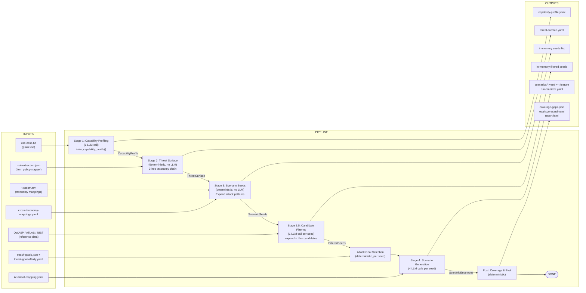

**Output details per stage:**

| Stage | Output File | Key Fields |
|-------|-------------|------------|
| Stage 1 | `capability-profile.yaml` | `zones_active: [input, reasoning]`, `has_persistent_memory: false`, `multi_agent: false`, `kc_subcodes: [KC1.1, KC3.3]`, `entry_points: [...]` |
| Stage 2 | `threat-surface.yaml` | `entries:` each with `risk_card`, `owasp_llm_ids: [LLM09]`, `agentic_threat_ids: [T7]`, `attack_pattern_ids: [AP-T7-01]` |
| Stage 3 | (in-memory) | `[ScenarioSeed(AP-T7-01), ScenarioSeed(AP-T15-01), ...]` |
| Stage 3.5 | (in-memory) | `[FilteredSeed(AP-T7-01, entry_point=..., technique_ids=...), ...]` |
| Stage 4 | `scenarios/AP-T7-01-f088b5.yaml` + `.feature` | One YAML + Gherkin pair per seed; `run-manifest.yaml` for pipeline metadata |
| Post | `coverage-gaps.json`, `eval-scorecard.yaml`, `report.html` | Coverage analysis, quality scores, HTML report |

---

## 2. Input Data Sources

| Source | Format | Example Content |
|--------|--------|-----------------|
| **use-case.txt** (user-provided) | `.txt` | `"A stateless LLM-powered customer service chatbot for an eBay-like marketplace. No memory, no tool access, no state."` |
| **risk-extraction** (from policy-mapper tool) | `.json` | `[{"risk_id": "atlas-hallucination", "risk_name": "Hallucination", "confidence": 0.809, "threat": "AI may generate inaccurate...", "vulnerability": "Lack of groundedness...", "consequence": "Untruthful content...", "impact": "Negative impacts on..."}]` |
| **SSSOM mappings** `data/taxonomies/attack-patterns/*.sssom.tsv` | `.tsv` | `AP-T1-01  scenario-forge  skos:exactMatch  T1-S1  owasp-agentic` / `AP-T1-01  scenario-forge  skos:relatedMatch  AML.T0020  mitre-atlas` |
| **Cross-taxonomy mappings** `data/taxonomies/mappings/` | `.yaml` | `t_to_asi:` `- source: T1, target: ASI06, predicate: exact_match, confidence: 1.0` |
| **OWASP LLM Top 10** `data/taxonomies/owasp-llm-top10/LLM{01-10}.json` | `.json` | `{"id": "LLM01", "name": "Prompt Injection", "severity": "Critical", "mappings": [{framework: "MITRE ATLAS", control_id: "AML.T0051.000"}...]}` |
| **OWASP Agentic Threats v1.1** `data/taxonomies/owasp-agentic-threats/` | `.yaml` | `threats:` `T7: {name: "Misaligned & Deceptive Behavior", attack_patterns: [AP-T7-01, AP-T7-02, ...]}` |
| **Attack Patterns** `data/taxonomies/attack-patterns/attack-patterns.yaml` | `.yaml` | `patterns:` `AP-T7-01: {threat_id: T7, name: "Constraint bypass via goal-priority conflict", prerequisite_capabilities: {min_zones: [input, reasoning], kc_requires: {any: [KC1.1, KC1.2, KC1.3, KC1.4]}}}` |
| **MITRE ATLAS** `data/taxonomies/atlas/` | `.yaml` | `techniques:` `AML.T0051: {name: "LLM Prompt Injection", tactic: "Initial Access"}` |
| **NIST AI 100-2** `data/taxonomies/nist-ai-100-2/` | `.yaml` | `classification_dimensions:` `- dimension: attacker_goal, values: [integrity, availability, confidentiality, abuse]` |
| **KC Threat Mapping** `data/taxonomies/mappings/kc-threat-mapping.yaml` | `.yaml` | `kc_to_threats: {KC1.1: [T5, T6, T7, T15], KC2.1: [T6, T8], KC4.3: [T1, T5, T6, T8], KC6.1.2: [T2, T3, T4, T9]}` / `threat_to_kc_subcodes: {T1: [KC4.3, KC4.4, KC4.5, ...]}` / `hitl: {threat_ids: [T10]}` |
| **Attack Goals** `data/taxonomies/attack-goals/attack-goals.json` | `.json` | `categories:` `- {id: "availability", name: "Availability Disruption", sub_goals: [{id: "AV-1", name: "Service Denial"}, ...]}` |
| **Threat-Goal Affinity Map** `data/taxonomies/attack-goals/threat-goal-affinity.yaml` | `.yaml` | `affinities: {T1: {primary: [integrity], secondary: [privacy, abuse], excluded: [availability]}}` |

---

## 3. Stage 2: Three-Hop Taxonomy Chain (Deterministic)

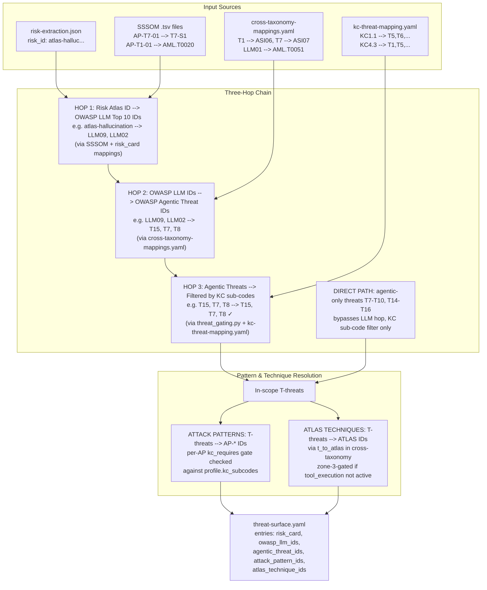

**Notes on the hop chain:**

- A threat is in scope if ANY of the profile's `kc_subcodes` maps to it in `kc_to_threats`
- HITL (T10) is cross-cutting, enabled by `profile.hitl`
- `min_zones` is still present in data but no longer checked in code -- `kc_requires` subsumes it
- Per-AP `kc_requires` gate: `{any: [...], all: [...]}` checked against `profile.kc_subcodes`

---

## 3b. Stage 3.5: Candidate Expansion + Filtering

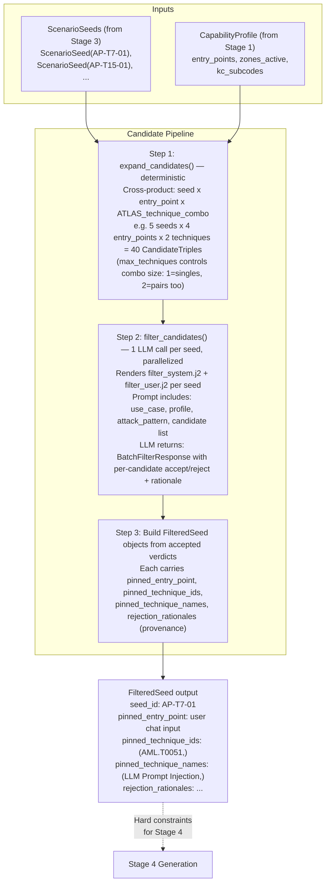

---

## 4. Attack Goal Selection (Deterministic, per Seed)

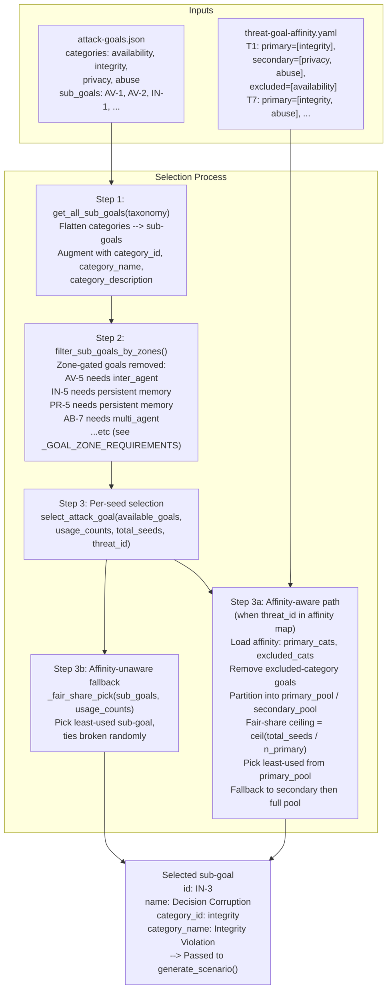

---

## 5. Stage 4: Per-Seed LLM Generation (4 Calls)

```mermaid
flowchart TD
    subgraph GenInputs["Inputs"]
        seed["ScenarioSeed<br>seed_id: AP-T7-01, threat_id: T7<br>attack_pattern_name, risk_card_ref,<br>owasp_llm_ids, agentic_threat_ids,<br>atlas_technique_ids, owasp_origin,<br>laaf_technique_ids, atlas_provenance_ids"]
        attackGoal["Selected Attack Goal<br>id: IN-3<br>name: Decision Corruption<br>category_id: integrity"]
    end

    subgraph Call0["CALL 0: Actor Profile"]
        call0Prompt["System: red-team persona generator<br>User: seed context + threat + use-case<br>+ profile.zones_active + kc_subcodes<br>+ entry_points + attack_goal context<br>+ actor type diversity hints<br>+ ATLAS technique context<br>Structured output (Pydantic)"]
        call0Out["ActorProfile<br>actor_type: nation-state<br>capability_level: intermediate<br>beliefs, desires, intentions<br>resources, goal_category: IN-3<br>goal_category_name, goal_category_parent"]
        call0Prompt --> call0Out
    end

    subgraph Call1["CALL 1: Narrative"]
        call1Prompt["System: red-team scenario writer<br>User: actor_profile + seed context<br>+ zones_active + kc_subcodes<br>+ entry point diversity hints<br>+ pattern exclusions<br>+ ATLAS technique context<br>Structured output (Pydantic)"]
        call1Out["NarrativeLayer<br>title: Subverting Class...<br>entry_point: user prompts...<br>zone_sequence: input, reasoning<br>steps with zone + action +<br>control_point annotations"]
        call1Prompt --> call1Out
    end

    subgraph Call2["CALL 2: Attack Tree"]
        call2Prompt["System: Produce a YAML attack tree<br>User: narrative steps + threat IDs<br>+ technique IDs + actor_profile<br>Unstructured text output<br>(parsed as YAML post-hoc)"]
        call2Out["AttackTree<br>goal: Generate deceptive...<br>root: id=n1, gate=AND<br>  children: id=n1.1, gate=OR<br>    children: LEAF nodes"]
        call2Prompt --> call2Out
    end

    subgraph Call3["CALL 3: Behavior Spec"]
        call3Prompt["System: Write a Gherkin feature file<br>User: narrative + attack_tree summary<br>+ use-case<br>Unstructured text output"]
        call3Out["Raw Gherkin text<br>@id:AP-T7-01-f088b5<br>Feature: Subverting Class...<br>  Background: Given access to Zone 1<br>  Scenario: When attacker submits..."]
        call3Prompt --> call3Out
    end

    seed --> call0Prompt
    attackGoal --> call0Prompt
    call0Out --> call1Prompt
    call1Out --> call2Prompt
    call2Out --> call3Prompt

    call3Out --> envelope

    envelope["ScenarioEnvelope (assembled)<br>scenario_id: AP-T7-01-f088b5<br>actor_profile, narrative, attack_tree, behavior_spec<br>scenario_seed_metadata, faceting, priority, generation<br>--> Written to: scenarios/AP-T7-01-f088b5.yaml<br>--> Written to: scenarios/AP-T7-01-f088b5.feature"]
```

**Generation metadata per call:**

| Call | Function | Typical Tokens (in/out) |
|------|----------|------------------------|
| Call 0 | `_call_actor_profile()` | ~950 / ~320 |
| Call 1 | `_call_narrative()` | ~2000 / ~640 |
| Call 2 | `_call_attack_tree()` | ~1140 / ~675 |
| Call 3 | `_call_behavior_spec()` | ~1490 / ~390 |

---

## 6. Complete Data Lineage (File-Level)

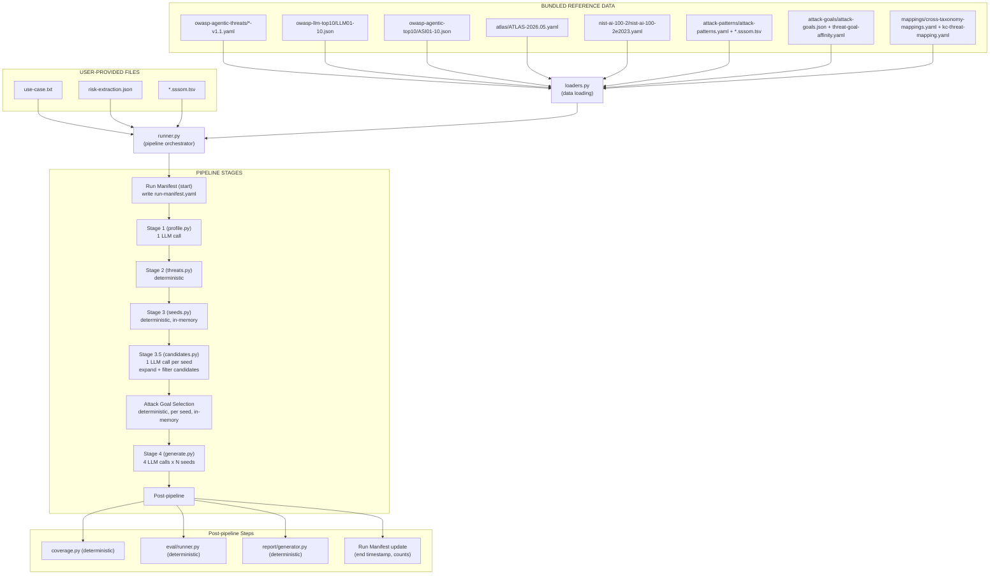

**Output directory structure:**

```
output/{name}/
├── run-manifest.yaml       (input hashes, model config, prompt template hashes)
├── use-case.txt
├── capability-profile.yaml
├── threat-surface.yaml
├── scenarios/
│   ├── AP-T7-01-f088b5.yaml
│   ├── AP-T7-01-f088b5.feature
│   ├── AP-T15-01-16cf51.yaml
│   ├── AP-T15-01-16cf51.feature
│   ├── calls.jsonl
│   └── ... (one pair per seed)
├── coverage-gaps.json
├── eval-scorecard.yaml
└── report.html
```

---

## 7. Diversity Enforcement (Batch-Level)

The runner tracks 6 diversity dimensions across the batch via Counters:

| Dimension | Counter | Strategy |
|-----------|---------|----------|
| **Entry Points** | `entry_point_usage` | `assign_entry_point()`: affinity score (keyword-to-zone Jaccard overlap) minus overuse penalty. `get_overused_entry_points()` builds exclude list. |
| **Attack Patterns** | `pattern_usage` | `extract_narrative_keywords()`: NLP keyword extraction from narrative. `get_overused_patterns()` builds exclude list to avoid repetitive attack techniques. |
| **Structural Patterns** | `structural_usage` | `extract_structural_pattern()`: phase-sequence hash (e.g. "inject->hallucinate->persist->bypass"). `get_overused_structural_patterns()` builds excludes. |
| **Actor Types** | `actor_type_usage` | Fair-share ceiling = `ceil(total_seeds / num_types)`. Least-used type preferred, overused types excluded. |
| **Capability Levels** | `capability_level_usage` | Least-used level preferred (hint, not enforced). 4 levels: novice, intermediate, advanced, expert. |
| **Attack Goals** | `goal_usage` | `select_attack_goal()`: affinity-aware fair-share. Primary affinity preferred, secondary fallback, excluded categories removed. See Section 4 above. |

All diversity hints are injected into LLM prompts as guidance. The LLM may deviate; actual generated values are tracked for subsequent seeds.

---

## 8. LLM Call Summary

| Stage | Function | Output Format | Typical Tokens (in/out) |
|-------|----------|---------------|------------------------|
| Stage 1 | `infer_capability_profile()` | Structured (Stage1Profile) | ~500 / ~100 |
| Stage 3.5 | `filter_candidates()` (1 call per seed) | Structured (BatchFilterResponse) | varies per seed (depends on candidate count) |
| Stage 4, Call 0 | `_call_actor_profile()` | Structured (ActorProfile) | ~950 / ~320 |
| Stage 4, Call 1 | `_call_narrative()` | Structured (NarrativeLayer) | ~2000 / ~640 |
| Stage 4, Call 2 | `_call_attack_tree()` | Unstructured (raw YAML text) | ~1140 / ~675 |
| Stage 4, Call 3 | `_call_behavior_spec()` | Unstructured (raw Gherkin text) | ~1490 / ~390 |
| **TOTAL** | 1 + N_seeds(filter) + 4 x N_filtered_seeds | | ~6k in + ~2k out per seed + filter + profiling calls |

**LLM Client Config:**

| Setting | Environment Variable | Default |
|---------|---------------------|---------|
| Base URL | `SCENARIO_FORGE_MODEL_BASE_URL` | (OpenAI-compatible endpoint) |
| API Key | `SCENARIO_FORGE_API_KEY` | — |
| Model | `SCENARIO_FORGE_MODEL_NAME` | `gemma-3n-e4b-it` |
| Max Tokens | `SCENARIO_FORGE_MAX_COMPLETION_TOKENS` | (optional) |

- **Structured calls:** `openai.beta.chat.completions.parse(response_format=PydanticModel)`
- **Unstructured calls:** `openai.chat.completions.create()` returning raw text

---

## 9. Schneider 5-Zone Model (Referenced Throughout)

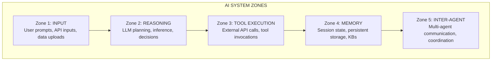

The capability profile determines which zones are active (e.g. a stateless chatbot only has zones `[input, reasoning]`). Stage 4 narratives and attack trees annotate every step/node with its zone. The eval scorecard checks zone alignment across all layers.

**KC Sub-Codes:** 27 granular capabilities (KC1.1-KC6.7) decompose what the system can do WITHIN each zone. They are inferred by Stage 1, stored in the capability profile as `kc_subcodes`, and used by:

- **threat_gating.py:** KC sub-codes determine which threats are in scope (via kc-threat-mapping.yaml: KC --> T-threats)
- **_evaluate_prerequisite_capabilities():** per-AP `kc_requires` gate checks `{any: [...], all: [...]}` against profile
- **LLM prompts (Calls 0-1):** passed as "System capabilities (KC sub-codes)" so the LLM constrains scenarios to actual system capabilities
- **filter_system.j2:** candidate filter prompt includes KC sub-codes for plausibility judgment

---

## 10. Run Manifest

Written at pipeline start; updated at pipeline end.

```yaml
# run-manifest.yaml (runner.py)
version: "0.1.0"                      # scenario-forge package ver
timestamp_start: "2026-07-06T..."     # pipeline start time
timestamp_end: "2026-07-06T..."       # pipeline end time (added)

inputs:
  use_case_hash: "sha256:..."         # SHA-256 of use-case.txt
  risk_extraction_hash: "sha256:..."  # SHA-256 of risk-extraction
  sssom_hash: "sha256:..."            # SHA-256 of SSSOM TSV

config:
  model: "gemma-3n-e4b-it"            # LLM model name
  temperature: 0.7                    # sampling temperature
  max_completion_tokens: null         # token limit (or null)
  prompt_template_hashes:             # SHA-256 per template file
    profile_system.j2: "sha256:..."
    profile_user.j2: "sha256:..."
    filter_system.j2: "sha256:..."
    filter_user.j2: "sha256:..."
    call0_system.j2: "sha256:..."
    call0_user.j2: "sha256:..."
    call1_system.j2: "sha256:..."
    call1_user.j2: "sha256:..."
    # ...

seeds_generated: 12                   # total seeds expanded
candidates_expanded: 48               # total candidates generated
candidates_accepted: 10               # candidates passing filter
candidates_rejected: 38               # candidates rejected
scenarios_generated: 10               # successful scenario count
scenarios_failed: 2                   # failed generation count
```

Purpose: Reproducibility and provenance. Enables diffing runs by comparing input hashes and model configuration.

---

## 11. Post-Pipeline Data Flows

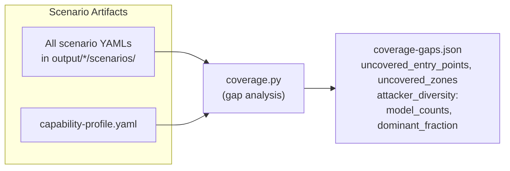

**Coverage Remediation Pass (runner.py):** If `uncovered_entry_points` exist after initial generation, `_remediate_coverage_gaps()` runs additional seeds to fill gaps.

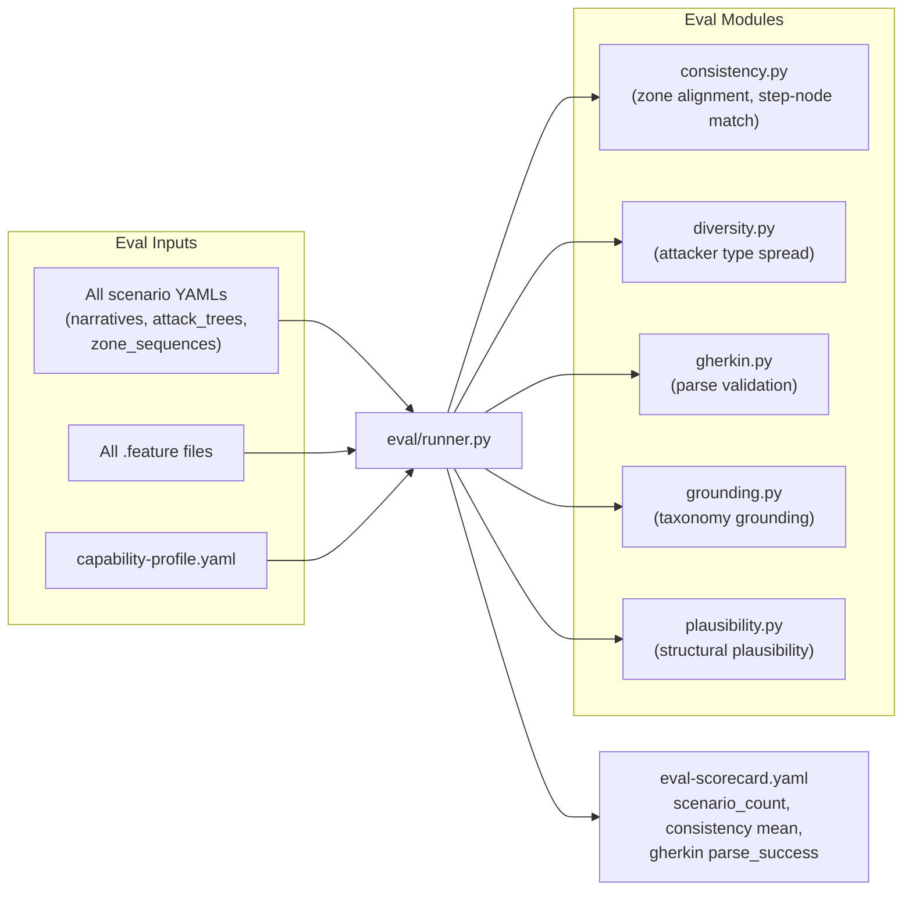

---

## 12. Report Generation Data Flow

`report/generator.py: generate_report(output_dir)`

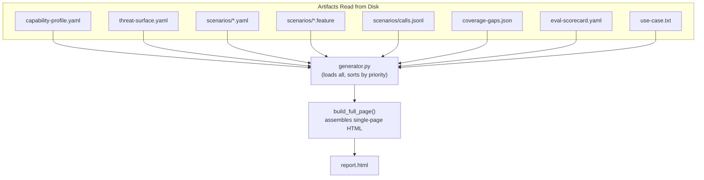

**Section builders** (template.py):

| Builder Function | Input |
|-----------------|-------|
| `build_use_case_section(use_case_text)` | Use case text |
| `build_capability_profile_section(profile_data)` | Profile data |
| `build_threat_surface_section(ts_data)` | Threat surface data |
| `build_coverage_section(coverage_data)` | Coverage data |
| `build_threat_technique_section(scenarios)` | Scenarios |
| `build_attacker_diversity_section(scenarios)` | Scenarios |
| `build_scenarios_section(scenarios, feature_files, call_logs, threat_surface=ts_data, capability_profile=profile_data)` | Scenarios + provenance chain data |
| `build_scorecard_section(scorecard_data)` | Scorecard data |
| `build_raw_data_section(raw_files)` | Raw files |
| `build_glossary_section()` | — |

**Report structure** (build_full_page):

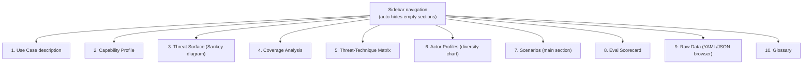

**Scenarios section detail** (build_scenarios_section):

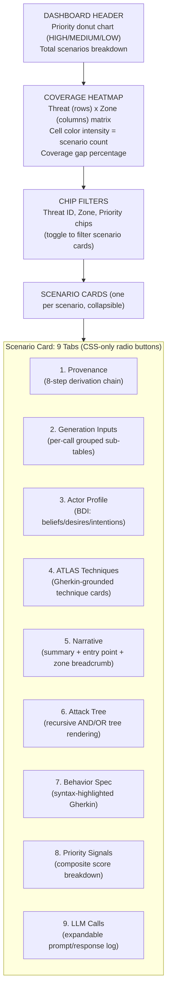

---

## 13. Provenance Chain (8-Step Derivation)

`_build_provenance_chain(scenario, threat_surface, capability_profile)`

Displayed as Tab 1 in each scenario card. Shows how deterministic pipeline inputs flowed into this specific scenario.

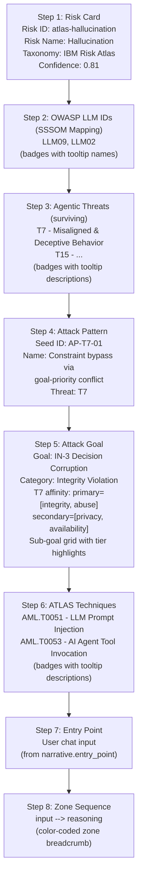

**Data sources for each step:**

| Steps | Data Source |
|-------|------------|
| Steps 1-3 | `faceting.risk_card`, `faceting.taxonomy_chain` |
| Step 4 | `scenario_seed_metadata` (seed_id, attack_pattern_name, etc.) |
| Step 5 | `actor_profile` (goal_category, goal_category_name, goal_category_parent) + live taxonomy/affinity data |
| Step 6 | `faceting.taxonomy_chain.atlas_technique_ids` |
| Step 7 | `narrative.entry_point` |
| Step 8 | `faceting.capability_profile.zones_traversed` |
